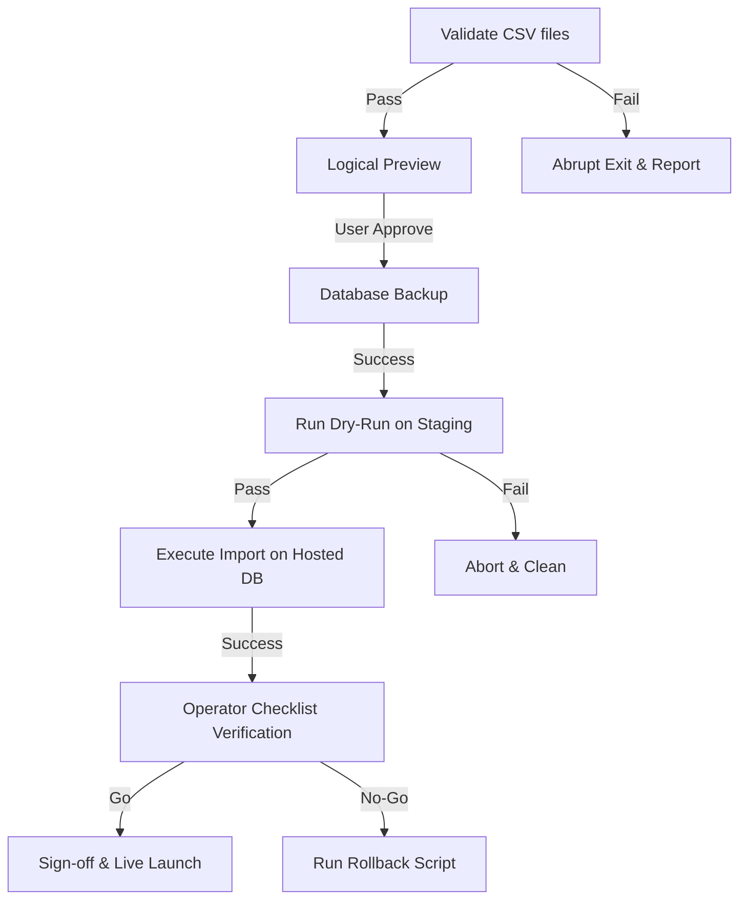

# 21 - Pilot Real-Data Import Plan v1

This document outlines the operational plan, data mapping, template designs, and validation gates for safely importing the first school pilot's real student and staff records into the Vercel + hosted Supabase environment.

> [!IMPORTANT]
> **Strict Security Boundary**
> - This is a planning and design document only.
> - **Do not import real student data** during this task.
> - **Do not commit real records** or spreadsheets to the repository.
> - Actual execution is blocked until this plan is approved and separate implementation/execution tasks are authorized.

---

## 1. Scope and Non-Goals

The first school pilot requires importing a minimal set of active records to allow staff to begin live tracking.

### A. In-Scope for First Pilot Import
- **Current School Year**: The active Academic Year metadata.
- **Staff Access Grants & Roles**: Pre-approvals allowing pilot staff to log in via Google OAuth and inherit correct roles (`staff`, `mentor`, `master`, `counselor`, `leadership`, `manager`, `super_admin`).
- **Student Groups**: Active student classes/cohorts for the current year.
- **Group Mentors**: Assignments of active staff to student groups.
- **Students**: Active student rosters (names, parent contact fields, and group linkages).
- **Projects**: Active student research/project titles and initial statuses (`green`, `yellow`, `red`).
- **Student Masters**: Assignments of staff mentors as primary/secondary masters for individual projects.
- **Student Goals**: Initial primary/central learning goals.
- **Followed Students**: Initial follow lists mapping mentors to their assigned students.

### B. Out-of-Scope (Deferred)
- **Bulk Photo Import**: Student profile photos will be uploaded manually by authorized mentors/managers in the app rather than batch-imported.
- **Historical Archive Import**: Historical data from previous academic years will not be imported.
- **Unstructured Message/Notes History**: Old staff notes/messages will not be imported to protect privacy and start with a clean slate.
- **Google Calendar Sync**: External calendar integration remains deferred.
- **Student App Sync**: Client access for students is not part of this staff-only pilot.

### C. First-Pilot Minimization Principle
Import only what is necessary to support active workflows. Avoid loading sensitive historical information or unused fields.

---

## 2. Data Source Inventory

| Source Name | Data Owner | Expected Format | Personal Data Level | Required / Optional | Destination Tables | Validation Owner | Approval Gate |
|---|---|---|---|---|---|---|---|
| **Staff List** | School Director | CSV | Medium (Emails, Names) | Required | `staff_access_grants` | Technical Lead | Gate 1 |
| **Staff Roles** | School Director | CSV | Low (Role Keys) | Required | `staff_access_grant_roles` | Technical Lead | Gate 1 |
| **Student Roster** | Registrar | CSV | High (Names, Phones) | Required | `students` | Registrar | Gate 2 |
| **Group Mapping** | Registrar | CSV | Low (Class Names) | Required | `student_groups` | Technical Lead | Gate 2 |
| **Mentor Assignment**| Pedagogic Head | CSV | Medium (Staff-to-Group) | Required | `group_mentors` | Pedagogic Head | Gate 2 |
| **Project Rosters** | Projects Coordinator| CSV | Medium (Titles, Status) | Required | `projects` | Projects Coordinator| Gate 2 |
| **Master Assignments**| Projects Coordinator| CSV | Medium (Staff-to-Project)| Required | `student_masters` | Projects Coordinator| Gate 2 |
| **Initial Goals** | Pedagogic Head | CSV | Low (Text Titles) | Optional | `student_goals` | Pedagogic Head | Gate 3 |
| **Followed Mapping** | Technical Lead | CSV | Medium (Staff-to-Student)| Optional | `followed_students` | Technical Lead | Gate 3 |

---

## 3. Destination Schema Mapping

### public.school_years
- **Purpose**: Tracks active and historical academic years.
- **Import Source**: System manifest.
- **Required Columns**: `id`, `name`, `starts_on`, `ends_on`, `is_current`.
- **Generated Columns**: UUID generated programmatically.
- **Uniqueness Rule**: Unique `name`, and only one row can have `is_current = true`.
- **RLS Sensitivity**: Read-only for active staff; write restricted to super-admin.
- **Rollback Strategy**: Hard delete by school year ID.

### public.staff_access_grants
- **Purpose**: Pre-approves staff emails before first Google OAuth sign-in.
- **Import Source**: Staff List.
- **Required Columns**: `email`, `is_active`.
- **Generated Columns**: `id` (random UUID), `created_at`, `updated_at`.
- **Uniqueness Rule**: Unique `email` (normalized lowercase).
- **RLS Sensitivity**: Private; read/write restricted to super-admin.
- **Rollback Strategy**: Delete records matching imported emails.

### public.staff_access_grant_roles
- **Purpose**: Assigns roles to pre-approved emails to bootstrap profiles.
- **Import Source**: Staff Roles.
- **Required Columns**: `grant_id`, `role`.
- **Generated Columns**: `id`, `created_at`.
- **Uniqueness Rule**: Unique composite `(grant_id, role)`.
- **RLS Sensitivity**: Restricted to super-admin.
- **Rollback Strategy**: Cascades on `grant_id` deletion.

### public.student_groups
- **Purpose**: Defines classes/cohorts for student assignments.
- **Import Source**: Group Mapping.
- **Required Columns**: `school_year_id`, `name`.
- **Optional Columns**: `layer` (e.g. `Junior High`, `High School`).
- **Generated Columns**: `id`, `created_at`, `updated_at`.
- **Uniqueness Rule**: Unique `(school_year_id, name)`.
- **RLS Sensitivity**: Read-only for active staff; write restricted to super-admin.
- **Rollback Strategy**: Delete groups created in the import batch.

### public.group_mentors
- **Purpose**: Maps staff members to student groups.
- **Import Source**: Mentor Assignment.
- **Required Columns**: `group_id`, `mentor_id` (joined from profiles via email), `is_primary`, `active_from`.
- **Optional Columns**: `active_until`.
- **Generated Columns**: `id`, `created_at`, `updated_at`.
- **Uniqueness Rule**: Strictest constraint: only one active primary mentor per group.
- **RLS Sensitivity**: Read-only for active staff; write restricted to super-admin.
- **Rollback Strategy**: Delete assignments created in the import batch.

### public.students
- **Purpose**: Core student records.
- **Import Source**: Student Roster.
- **Required Columns**: `school_year_id`, `group_id`, `first_name`, `last_name`, `is_active`.
- **Optional Columns**: `primary_phone`, `secondary_phone`, `emergency_contact_name`, `emergency_contact_phone`.
- **Generated Columns**: `id`, `created_at`, `updated_at`.
- **Uniqueness Rule**: Unique mapping of student per year (names + phone combination).
- **RLS Sensitivity**: Read-only for active staff; write restricted to manager/super-admin.
- **Rollback Strategy**: Cascade delete students via import batch ID.

### public.projects
- **Purpose**: Track active student projects.
- **Import Source**: Project Rosters.
- **Required Columns**: `student_id`, `school_year_id`, `title`, `status` (`green`/`yellow`/`red`), `is_current`, `created_by`, `updated_by`.
- **Optional Columns**: `description`, `status_note`.
- **Generated Columns**: `id`, `created_at`, `updated_at`.
- **Uniqueness Rule**: Unique current project per student (`is_current = true` partial index).
- **RLS Sensitivity**: Read-only for active staff; write restricted to project masters and managers/super-admins.
- **Rollback Strategy**: Cascade delete projects.

### public.student_masters
- **Purpose**: Map staff members as masters of student projects.
- **Import Source**: Master Assignments.
- **Required Columns**: `student_id`, `project_id`, `master_id` (profile ID), `is_primary`, `active_from`.
- **Optional Columns**: `active_until`.
- **Generated Columns**: `id`, `created_at`, `updated_at`.
- **Uniqueness Rule**: Unique active primary master assignment per student project.
- **RLS Sensitivity**: Read-only for active staff; write restricted to super-admin.
- **Rollback Strategy**: Cascade delete assignments.

### public.student_goals
- **Purpose**: Track student learning goals.
- **Import Source**: Initial Goals.
- **Required Columns**: `student_id`, `school_year_id`, `title`, `status` (`active`/`completed`/`paused`), `is_primary`, `created_by`, `updated_by`.
- **Optional Columns**: `description`.
- **Generated Columns**: `id`, `created_at`, `updated_at`.
- **Uniqueness Rule**: Unique active primary goal per student per year.
- **RLS Sensitivity**: Read-only for active staff; write restricted to mentors and managers/super-admins.
- **Rollback Strategy**: Cascade delete goals.

---

## 4. Proposed Import Template Design

All CSV headers use English. The mock data rows below are strictly **fake names**.

### Template 1: `staff_access_grants_template.csv`
- **Purpose**: Pre-authorizes pilot staff accounts.
- **Columns**: `email`, `is_active`
- **Allowed Values**: `email` must match the institutional domain. `is_active` must be `true` or `false`.
- **Example Row**:
  ```csv
  email,is_active
  mentor.test@chamama.org,true
  counselor.test@chamama.org,true
  ```

### Template 2: `staff_roles_template.csv`
- **Purpose**: Assigns app roles to pre-authorized emails.
- **Columns**: `email`, `role`
- **Allowed Values**: `role` must be in: `staff`, `mentor`, `master`, `counselor`, `leadership`, `manager`, `super_admin`.
- **Example Row**:
  ```csv
  email,role
  mentor.test@chamama.org,mentor
  mentor.test@chamama.org,master
  counselor.test@chamama.org,counselor
  ```

### Template 3: `student_groups_template.csv`
- **Purpose**: Creates student groups/classes.
- **Columns**: `group_name`, `layer`, `is_active`
- **Allowed Values**: `layer` is optional. `is_active` defaults to `true`.
- **Example Row**:
  ```csv
  group_name,layer,is_active
  Group Alpha,High School,true
  Group Beta,Junior High,true
  ```

### Template 4: `students_template.csv`
- **Purpose**: Defines student profile rosters.
- **Columns**: `external_student_id`, `first_name`, `last_name`, `group_name`, `primary_phone`, `secondary_phone`, `emergency_contact_name`, `emergency_contact_phone`
- **Allowed Values**: `external_student_id` is a unique temporary string (e.g. school database ID) to resolve relations.
- **Example Row**:
  ```csv
  external_student_id,first_name,last_name,group_name,primary_phone,secondary_phone,emergency_contact_name,emergency_contact_phone
  STUD-2026-001,John,Doe,Group Alpha,+972500000001,,Jane Doe,+972500000002
  ```

### Template 5: `group_mentors_template.csv`
- **Purpose**: Links staff mentors to student groups.
- **Columns**: `group_name`, `mentor_email`, `is_primary`, `active_from`
- **Allowed Values**: `is_primary` must be `true` or `false`. `active_from` is ISO Date (`YYYY-MM-DD`).
- **Example Row**:
  ```csv
  group_name,mentor_email,is_primary,active_from
  Group Alpha,mentor.test@chamama.org,true,2025-09-01
  ```

### Template 6: `projects_template.csv`
- **Purpose**: Establishes student projects and statuses.
- **Columns**: `external_student_id`, `project_title`, `description`, `status`
- **Allowed Values**: `status` must match `green`, `yellow`, or `red`.
- **Example Row**:
  ```csv
  external_student_id,project_title,description,status
  STUD-2026-001,Smart Recycling Classifier,Image classification model,green
  ```

### Template 7: `student_masters_template.csv`
- **Purpose**: Maps project masters to student projects.
- **Columns**: `external_student_id`, `master_email`, `is_primary`, `active_from`
- **Example Row**:
  ```csv
  external_student_id,master_email,is_primary,active_from
  STUD-2026-001,mentor.test@chamama.org,true,2025-09-01
  ```

### Template 8: `student_goals_template.csv`
- **Purpose**: Seeds initial learning goals.
- **Columns**: `external_student_id`, `goal_title`, `description`, `status`, `is_primary`
- **Allowed Values**: `status` must be `active`, `completed`, or `paused`.
- **Example Row**:
  ```csv
  external_student_id,goal_title,description,status,is_primary
  STUD-2026-001,Train MobileNet Backbone,Dataset sorting and verification,active,true
  ```

### Template 9: `import_manifest_template.csv`
- **Purpose**: Defines metadata about the import run for audit logging.
- **Columns**: `school_year_name`, `data_owner_email`, `operator_email`, `import_batch_id`
- **Example Row**:
  ```csv
  school_year_name,data_owner_email,operator_email,import_batch_id
  2025-2026 Academic Year,director@chamama.org,tech.op@chamama.org,batch-20260711-v1
  ```

---

## 5. Identity and ID Strategy

### A. Staff Identity
- **Primary Key**: Normalized, lowercase email.
- **Verification**: On login, OAuth provider metadata email is verified against `staff_access_grants`. Only matching domains and pre-approved emails can log in.

### B. Student Identity
- **Staging Identifier**: `external_student_id` is required in the source CSV. This ID is used strictly during import parsing to map student rows to their projects, goals, and masters.
- **App Database UUIDs**: Random UUIDs are generated during data insertion. The script maintains an in-memory map of `external_student_id -> database_uuid` during execution to populate foreign keys.
- **No Long-term school IDs**: To protect privacy, actual school-specific ID numbers are not stored in the database.

### C. Duplicate Handling
- **Duplicate Staff Email**: The script skips or merges roles on duplicate emails.
- **Duplicate Student Name/ID**: If a duplicate `external_student_id` is found, the validator fails the run.
- **Duplicate Current Project**: The script enforces that only one project is marked `is_current = true` per student.

### D. Renames and Modifications
- Post-import renames (such as student last names or group re-assignments) are managed through the application interface by managers/super-admins, triggering audit logs.

---

## 6. Privacy and Data Minimization Plan

### A. Data Minimization
- **Photos**: Deleted/Deferred. No student photos will be imported in bulk.
- **Notes & Messages**: No historical notes will be imported. Messages remain completely empty at pilot start.
- **Contact Details**: Only essential numbers are loaded (primary parent phone).

### B. Sensitive Fields
- **Goals & Project Statuses**: Visible only to authenticated active staff members.
- **Audit Logging**: Every write mutation records the actor's profile ID, action type, and timestamps in `public.audit_logs`, which is restricted to managers and super-admins.

### C. Operational Safeguards
1. **Approval Gate**: The School Director must sign off on the CSV datasets.
2. **Backup Preflight**: Supabase physical/logical backup is taken immediately before import.
3. **Rollback Window**: Operator must run verification within a 60-minute window and trigger rollback if any errors are observed.
4. **Git Safety**: Real data files are kept in a local secure folder outside the repository. The git status is verified clean before and after execution.

---

## 7. Import Pipeline Design

The import pipeline runs via a CLI script designed to execute locally, utilizing a transaction rollback model:



### Proposed Staging Scripts (Future Task)
- `scripts/import/validate-real-data.ts`: Validates headers, formats, enums, and foreign keys in source CSV files.
- `scripts/import/preview-import.ts`: Prints a summary of rows to be created/updated (dry-run mode).
- `scripts/import/run-import.ts`: Performs the actual database writes within a single PostgreSQL transaction.
- `scripts/import/rollback-import.ts`: Rolls back an entire import batch by targeting rows marked with `import_batch_id`.

---

## 8. Validation Rules

- **Emails**: Must belong to the institutional domain (checked via `isEmailDomainAllowed`).
- **Roles**: Must belong to the role enum: `staff`, `mentor`, `master`, `counselor`, `leadership`, `manager`, `super_admin`. (Orphan role keys like `teacher` are rejected).
- **Group Assignment**: Every student must be linked to a valid, active `student_group`.
- **Project Statuses**: Must be exactly `green`, `yellow`, or `red`.
- **Time ranges**: `active_from` must be a valid date, and `active_until >= active_from` (if provided).
- **Goals Constraint**: Only one primary goal (`is_primary = true`) can exist per student.
- **Foreign Keys**: Every master email and mentor email must match a pre-authorized staff email.

---

## 9. Backup, Rollback, and Cleanup Design

### A. Pre-Import Backup
The operator must execute a manual database backup via Supabase CLI or Dashboard before running the import:
`supabase db dump --linked --data-only > backups/pre_import_backup.sql`

### B. Rollback by Batch ID
All imported rows will be tagged with a unique metadata tag or stored inside a dedicated staging log. The rollback script targets this batch identifier:
```sql
BEGIN;
DELETE FROM public.student_goals WHERE created_at > 'import_timestamp' AND created_by = 'operator_id';
DELETE FROM public.projects WHERE created_at > 'import_timestamp';
DELETE FROM public.students WHERE created_at > 'import_timestamp';
-- profiles/roles are kept but can be deactivated manually if needed
COMMIT;
```

### C. Post-Import Cleanup
- Delete all local CSV files containing real data.
- Run `git status` to verify no data sheets are tracked.

---

## 10. Pilot Verification Checklist

After import, the technical operator must verify:
- [ ] **Role Permissions**: Log in as a staff member and verify that `/admin/access-grants` yields a 403 / redirects.
- [ ] **Student Roster**: Navigate to `/students` and confirm that the total student count matches the CSV count.
- [ ] **Search & Filters**: Search for a student and confirm the card renders.
- [ ] **Project Updates**: Log in as a master and verify project status can be updated. Confirm that regular staff cannot update it.
- [ ] **Audit Trail**: Open `/admin/audit` as a manager and verify that the import manifest metadata is correctly logged under the operator's actions.
- [ ] **Public Storage Denial**: Confirm that public access to the storage bucket is denied.

---

## 11. Go/No-Go Gates

1. **Gate 1: Schema & Performance Approval**
   - *Requirement*: Performance fixes meet latency thresholds (<650ms student card load).
   - *Status*: **PASSED** (Baseline optimized).
2. **Gate 2: CSV Data Sign-off**
   - *Requirement*: School Director and Registrar sign off on the accuracy of the fake-free staff and student roster CSV files.
   - *Status*: **PENDING** (Blocked until template implementation).
3. **Gate 3: Dry-Run Verification**
   - *Requirement*: Import scripts successfully run on a local development copy of the database without constraints violations.
   - *Status*: **PENDING**.
4. **Gate 4: User Execution Sign-off**
   - *Requirement*: User reviews the dry-run summary and gives explicit permission to run against the production Supabase database.
   - *Status*: **PENDING**.

---

## 12. Recommendation

We recommend proceeding to **Pilot Real-Data Import Templates v1** as the immediate next step. This will provide the school with empty CSV templates containing the correct headers and documentation to prepare their rosters safely.
